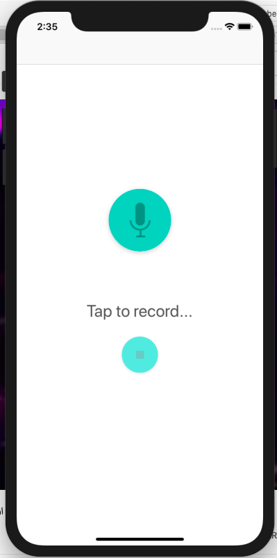
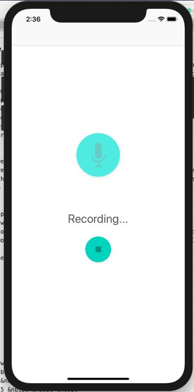
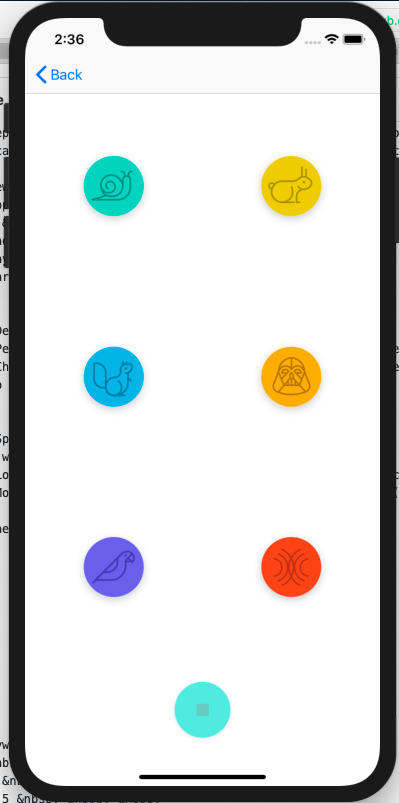
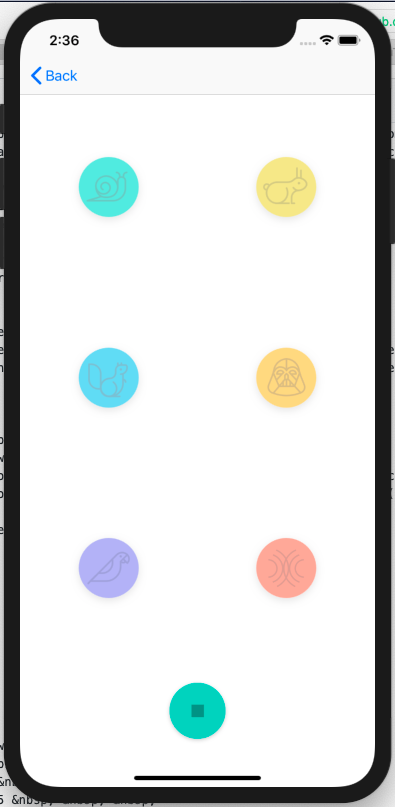

## udacity.com student submission
> AppVersion 1.0 &nbsp; &nbsp; &nbsp;
> [Swift 5](https://swift.org) &nbsp; &nbsp; &nbsp;
> [iOS Nanodegree Course](https://www.udacity.com/course/ios-developer-nanodegree--nd003)
_This repository contains the project submission for udacity.com project work "PitchPerfect" during my iOS developer certification program ([iOS Nanodegree Course](https://www.udacity.com/course/ios-developer-nanodegree--nd003))._

## Frameworks & Technologies
_This app uses the following frameworks & technologies_
> UIKit &nbsp; &nbsp; &nbsp;
> AVFoundation &nbsp; &nbsp; &nbsp;
> AutoLayout &nbsp; &nbsp; &nbsp;
> Asynchronous Programming

#Viewcontrollers
RecordSoundsViewController - This has the record button and stop record button, once recording is dont it navigates to PlaySoundsViewController with the performSegue function.
PlaySoundsViewController - This view uses the audio recorded and has six different buttons for playbacks.

## App Specifications
The app will have two view scenes.
  - **_Recording View_**: Allows user record sounds.
  - **_Playing View_**: Allows user to play the recorded sound by six different tones.

The scenes are described in detail below.

## 1) Recording View

When the app first starts it will open the _Recording View_.
  - User can start recording by tapping the recording button.
  - By pressing the stop button the recording should stpped and navigate the user to the _Playing View_ for playing his/her recording.

&nbsp; &nbsp;
&nbsp; &nbsp;

## 2) Playing View

This view allows user to play the recorded sound by six different tones.

&nbsp; &nbsp;
&nbsp; &nbsp;

  ## Keywords
> iOS &nbsp; &nbsp; &nbsp;
> Swift &nbsp; &nbsp; &nbsp;
> Swift 5 &nbsp; &nbsp; &nbsp;
> XCode &nbsp; &nbsp; &nbsp;
> UIKit &nbsp; &nbsp; &nbsp;
> AVFoundation &nbsp; &nbsp; &nbsp;
> Record &nbsp; &nbsp; &nbsp;
> Mobile Development &nbsp; &nbsp; &nbsp;
> Udacity &nbsp; &nbsp; &nbsp;
> Extensions &nbsp; &nbsp; &nbsp;
> Foundation &nbsp; &nbsp; &nbsp;
> AutoLayout &nbsp; &nbsp; &nbsp;
> Asynchronous Programming
  # Demo
  > [Udacity App Demo](https://youtu.be/z-B0BfsEPpI)
